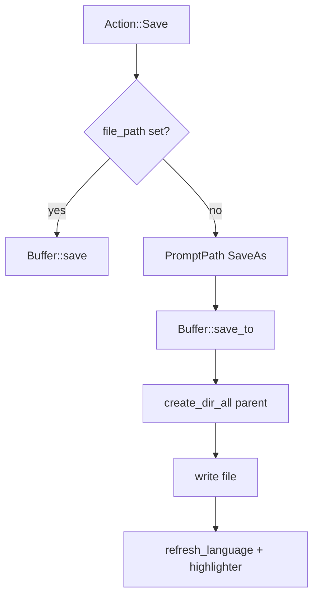

# TermEdit developer guide

This document explains how the editor is structured so you can fix bugs, add features, and keep changes maintainable.

## Crate layout

| Area | Role |
|------|------|
| [`src/main.rs`](../src/main.rs) | CLI (`clap`), settings/theme load, session restore, `App::run`. |
| [`src/app.rs`](../src/app.rs) | Event loop, modal/palette routing, tabs, AI debounce, save/quit flows. |
| [`src/core/`](../src/core/) | `Buffer` (ropey), `Document` (buffer + cursor + history), `Cursor`, `History`. |
| [`src/feature/`](../src/feature/) | Search (`search.rs`: single-buffer find + `collect_matches` / `search_open_tabs`), **outline** (`outline.rs`, tree-sitter symbols), syntax highlighting, session snapshot, language detection, AI worker, completions. |
| [`src/config/`](../src/config/) | `Settings`, `Theme`, `keymap` (`Action` enum). |
| [`src/ui/`](../src/ui/) | Ratatui widgets: editor pane, tab bar, modals, command palette, **outline palette**, **open tabs palette** (`open_tabs_palette.rs`), status bar. |

## File save pipeline

1. **Buffer** ([`buffer.rs`](../src/core/buffer.rs)): `save()` writes to `file_path`; `save_to(path)` creates parent directories with `create_dir_all`, writes bytes (encoding + line endings), then sets `file_path` and clears `modified`.
2. **Missing files**: `Buffer::from_file_or_new` returns an empty buffer with `file_path` set if the path is not found (CLI open).
3. **Untitled**: `file_path` is `None`. **Save** (`Ctrl+S`) opens a path modal (`ModalKind::PromptPath(SaveAs)`).
4. **After Save As**: [`Document::refresh_language`](../src/core/document.rs) and `App::refresh_tab_language` re-run language detection from the new path and rebuild that tab’s [`SyntaxHighlighter`](../src/feature/syntax.rs).

## Modal and pending actions

- **Path prompt**: `path_prompt_after_save` holds what to do after a successful Save As from the dialog:
  - `PathAfterSave::CloseTab(i)` — remove tab `i` (user confirmed save on close).
  - `PathAfterSave::QuitSaveAll` — continue saving remaining modified buffers, or quit when clean.
- **Save confirm**: `SaveConfirmPending` distinguishes close-tab vs quit. Quit + “yes” saves all buffers that already have a path, then prompts Save As for each remaining modified untitled tab in turn.

Add a new modal kind in [`modal.rs`](../src/ui/modal.rs), then branch in `App::handle_modal_key` and extend `ModalWidget::render`.

## Command palette

- **State**: [`CommandPaletteState`](../src/ui/command_palette.rs) (`filter`, `selected`, `filtered_indices`).
- **Commands**: extend [`PaletteCmd`](../src/ui/command_palette.rs) and `PaletteCmd::all()`. Map to an [`Action`](../src/config/keymap.rs) via `PaletteCmd::to_action()` where possible; for behavior that is not a single key action, call `App` helpers from `handle_action` or add a dedicated method.
- **UI**: [`CommandPaletteWidget`](../src/ui/command_palette.rs) draws the overlay; `App::render` draws it when `command_palette.visible` (after the main modal so palette stays on top if both were ever shown—normally only one is active).

## Go to Symbol (outline)

- **Parsing**: [`feature/outline.rs`](../src/feature/outline.rs) uses **tree-sitter** (grammars already declared in `Cargo.toml`) to collect top-level symbols for `rust`, `python`, `javascript`, `typescript`, and `go`. Language id comes from [`language.rs`](../src/feature/language.rs) (`Document::language`).
- **UI**: [`outline_palette.rs`](../src/ui/outline_palette.rs) mirrors the command palette: snapshot `Vec<OutlineSymbol>` at open, substring filter, selection + scroll.
- **App wiring**: `App::handle_event` gives **outline** priority over the command palette; opening one closes the other (`Action::GoToSymbol` + `Action::CommandPalette`). Settings: `outline_enabled`, `outline_max_bytes` in [`settings.rs`](../src/config/settings.rs).
- **Extending**: add a grammar dependency if needed, branch in `language_for` / collector in `outline.rs`, and add detection in `language.rs` if it is a new file type.

## Find in Open Tabs

- **Core**: [`search_open_tabs`](../src/feature/search.rs) walks `&[Document]` in tab order, uses [`collect_matches`](../src/feature/search.rs) per buffer (skips oversized tabs), caps total hits, returns `OpenTabHit` rows (tab index, label, char offset, line, preview).
- **UI**: [`open_tabs_palette.rs`](../src/ui/open_tabs_palette.rs) — query field + list; `App` debounces refresh via `find_in_open_tabs_debounce_ms`.
- **Settings**: `find_in_open_tabs_*` in [`settings.rs`](../src/config/settings.rs); `Action::FindInOpenTabs` + command palette entry in [`keymap.rs`](../src/config/keymap.rs) / [`command_palette.rs`](../src/ui/command_palette.rs).

## Search performance

- **Literal** search uses a rope scan (`collect_literal_rope_matches` in [`search.rs`](../src/feature/search.rs)) without allocating a full-document `String` for the primary Find UI and for **Find in Open Tabs** on each eligible tab.
- **Regex** search still materializes `rope.to_string()` per buffer for the regex engine.

## Keyboard map

User-facing shortcuts are implemented in [`keymap.rs`](../src/config/keymap.rs) (`map_key_event` → `Action`). Add new variants to `Action` and handle them in `App::handle_action` (and palette if desired).
